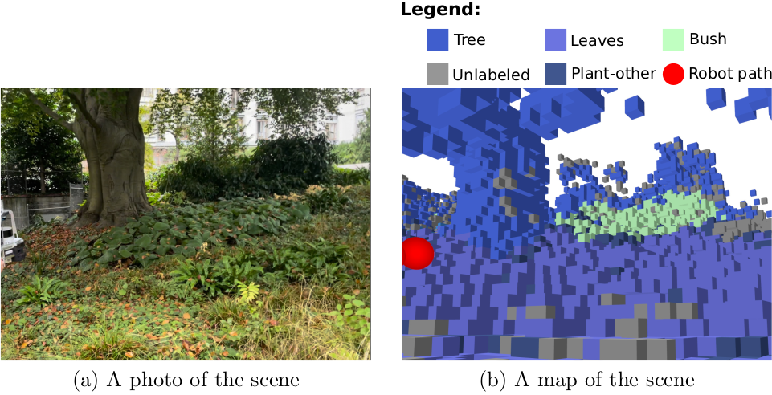
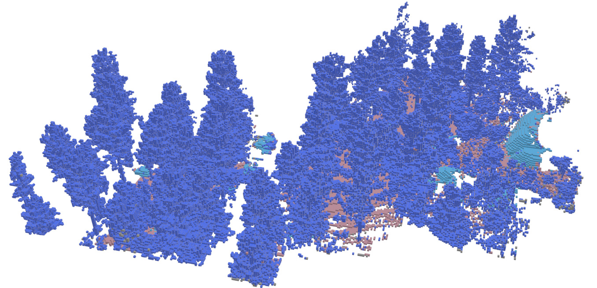

# G-SVOM
## A GPU Accelerated Semantic Voxel Off-Road Mapping System

G-SVOM is a voxel mapping framework for path planning and navigation in unstructured, outdoor environments. It converts point clouds into geometric voxel maps
containing not only occupancy information but also additional values, like hard and soft obstacle detection and slope estimates. Each voxel also contains a
semantic label, which is provided from semantically segmented images. To assign the semantic labels  from images to the voxels, G-SVOM can use several different
methods, from simple projection to a neural network, which takes into account the label being assigned and the geometric context of each candidate voxel.

For a full explanation of how the different semantic label association methods work and the analysis of their strengths and weaknesses, please read our
[report](readme_data/GSVOM_report.pdf). G-SVOM is an extension of G-VOM, which provides the geometric mapping backbone, we highly recommend checking out its
[repository](https://github.com/unmannedlab/G-VOM) to learn about its full capabilities.

##  Usage

### Prerequisities

- [Python 3.6](https://www.python.org/downloads/) or later.

- [Numba](https://numba.pydata.org/numba-doc/latest/user/installing.html) and [Numba CUDA](https://numba.pydata.org/numba-doc/latest/cuda/overview.html#setting-cuda-installation-path).

- [Numpy](https://numpy.org/install/)

- [Pytorch](https://pytorch.org/)

- (optional to run `gsvom_ros.py`) [ROS Noetic](http://wiki.ros.org/ROS/Installation)

### Implementation explanation

The system is implemented within a class in `scripts/gsvom.py`. There are four public functions: Class initialization, `process_pointcloud`, `combine_maps`, and
`process_semantics`. 

Class initialization initialises all parameters for the class. A description of each parameter is provided in the file. It is important to mention, that the
class receives the semantic labels association method this way in a dependency injection scheme. The possible methods are implemented in the
`scripts/semantic_association` folder, including a factory method to properly set them up. The neural network-based methods (`ModelV1` and `ModelV6`) have
their pretrained weights included in the `config/model_weights` folder and work out of the box for any camera configuration.

`process_pointcloud` takes a point cloud, robot position in the world frame, a transform matrix from the lidar frame to the world frame and optionally the
current timestamp. It processes the point cloud into an intermediate voxel map then adds the map to the intermediate map buffer. The transform matrix is
necessary as all map processing is in the world frame.
 
`combine_maps` takes no inputs and processes all maps in the intermediate map buffer into a combined map and set of 2D output maps. The outputs are the map
origin in the world frame, positive obstacle map, negative obstacle map, roughness map and a visibility map.

`process_semantics` takes a semantically segmented image and the camera intrinsic and extrinsic calibration parameters and uses them to add semantic labels to
the combined map created in `combine_maps`. To use the `ModelV1` and `ModelV6` semantic label to voxel association methods, the semantically segmented images
must contain only the labels listed in the `config/segmentation_classes.txt` file represented by their corresponding numbers. The other methods are semantic
label agnostic.

Note: Multiple sensors can each call `process_pointcloud` in parallel and then be asynchronously
merged with `combine_maps`, to do this we recommend a buffer size greater than twice the number of sensors. Because both `combine_maps` and `process_semantics`
operate on the combined map, these two functions cannot be run in parallel.

The labeled voxel map can be visualized using the `get_map_as_painted_occupancy_pointcloud` function of the G-SVOM class. The color for each label is picked by
the `config/label_colors.txt` file. How to use this function is shown in the ROS example.

### ROS Example
An example ROS implementation is provided in `scripts/gsvom_ros.py`. It subscribes to a `PointCloud2` message, an `Odometry` message and three `Image` and
`CameraInfo`. Additionally, it requires a tf tree between the `odom_frame`, the `PointCloud2` message’s frame and the `Image` message's frame. It’s assumed that
the `Odometry` message is in the `odom_frame`.

The example ROS node can also be launched using an example launch file in the `launch` directory.
